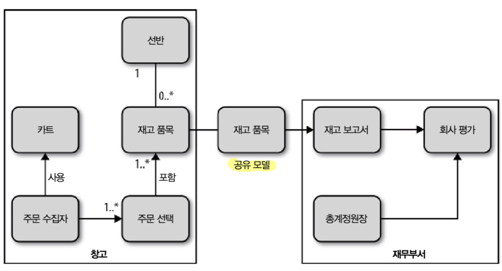
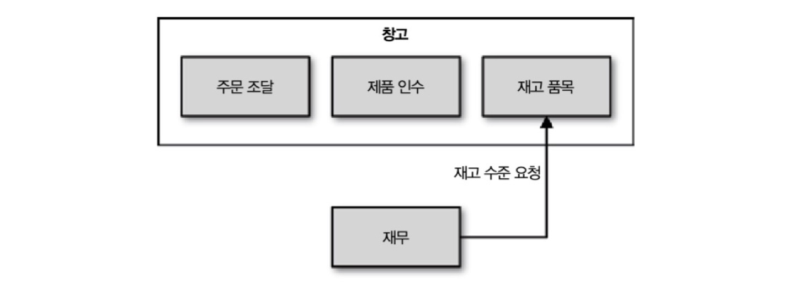
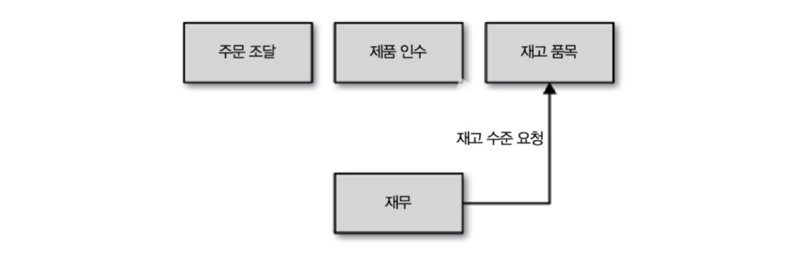

## 03 서비스 모델링하기

이 장에서는 마이크로서비스의 장점을 극대화하고 잠재적인 단점을 회피할 수 있는 **마이크로서비스 경계**에 대해 생각해보는 시간을 가진다.

### 3.1 뮤직코퍼레이션 소개

***"성공을 위한 열쇠가 바로 마이크로 서비스다!"***

이 책에서 사용할 가상의 도메인을 소개한다.

최첨단 온라인 소매 회사인 뮤직코퍼레이션은 최근까지만 해도 오프라인 소매점이었으나 축음기 음반 산업이 바닥을 친 후 온라인 사업에 더 집중하게 되었다. 오프라인 위주이긴 해도 회사 웹사이트 정도는 가지고 있었던 그들은 지금이야말로 잃었던 것을 만회하기 위해 제대로 온라인 세상에서 더블다운할 때라 여기고 있다. 비록 현실에 좀 뒤쳐지기는 했지만, 원대한 야망을 품고 있는 뮤직코퍼레이션은 세계를 석권할 **최고의 기회가 가능한 한 쉽게 변화하는 것**에 달려 있다고 판단했다. 

### 3.2 무엇이 좋은 서비스를 만드는가?

무엇이 좋은 서비스를 만드는가? **느슨한 결합(loose coupling)**과 **강한 응집력(high cohesion)**이다. 다른 실천 사항도 있겠지만 이 두 가지가 잘못되면 나머지도 의미가 없다.

#### 3.2.1 느슨한 결합

***"느슨하게 결합된 서비스는 그와 협업하는 서비스에 관해 알 필요 없다."***

서비스가 서로 느슨히 결합되어 있으면 하나의 서비스가 변경될 때 다른 서비스가 변경되는 일이 없어진다. 마이크로서비스의 요점은 시스템의 그 어떤 부분도 추가 변경할 필요 없이 특정 서비스를 변경하고 배포할 수 있다는 것이다.

#### 3.2.2 강한 응집력

서로 연관된 행위가 한 곳에 모이고 다른 경계와는 가능한 한 느슨하게 소통할 수 있도록 문제 영역을 모아두는 것을 말한다. 이렇게하면 특정 행위를 변경하고자 할 때 한 곳에서 변경 및 배포가 가능하다. 만약 여러 곳에서 행위를 변경해야 한다면 해당 변경 사항을 적용하기 위해 많은 서비스를 (아마 동시에) 배포해야 할 것이다.

### 3.3 경계가 있는 콘텍스트

> ***경계가 있는 콘텍스트(bounded context)***
>
> 특정 모델에 대해 경계가 정해진 적용 기능성, 콘텍스트르 제한함에 따라 팀원들로 하여금 무엇에 대해 일관성을 유지하고, 무엇을 독립적으로 개발할 수 있을지 명확하게 공유할 수 있게 한다.

모든 도메인은 다수의 경계가 있는 콘텍스트로 구성되며, 각 콘텍스트 내에는 외부와 통신할 필요가 없는 것뿐만 아니라 경계가 있는 다른 콘텍스트와 공유되는 것이 함께 존재한다. 경계가 있는 콘텍스트에는 명백한 인터페이스가 존재하며, 그것은 어떤 모델이 다른 콘텍스트와 공유될지 결정한다. 

뮤직코퍼레이션 사업도 마찬가지다. 도메인은 전체 사업에 해당하며 여기에는 창고부터 접수까지, 재무부터 주문까지 모든 것이 포함된다. 

경계가 있는 콘텍스트를 생각해보자: 

- **창고**는 배송될 주문을 관리하고, 재고를 인수하고, 지게차들이 바삐 움직이는 등의 행위가 이루어진다.
- **재무부서**는 직원들의 급여를 관리하고 장부를 기록하며, 중요한 보고서를 작성한다.

#### 3.3.1 감춰진 공유 모델

***재무부서와 창고 사이의 공유 모델***

창고와 재무부서 두 곳 모두 외부 세상에 **명시적인 인터페이스**를 제공하며, 각자만 알고 있어야 할 **세부 사항**이 있다. 재무부서는 창고 내부의 세부 사항에 대해 세세하게 알 필요는 없지만 적어도 몇 가지는 알아야한다. 

재무부서 직원들은 회사 평가를 산출하기 위해 우리가 가진 재고 품목 정보가 필요하며, 따라서 재고 품목은 두 콘텍스트 간의 공유 모델이 된다. **그러나 창고 콘텍스트에 있는 재고 품목의 모든 것을 노출할 필요는 없다는 것이 중요하다.**

예를 들어 재고 품모에 내부적인 것을 기록하더라도 창고 내에서만 유지되며 공유 모델에 노출할 필요는 없다. **그에 따라 내부 전용 표현과 우리가 노출하는 외부 표현으로 구분할 수 있다.**

#### 3.3.2 모듈과 서비스

새로운 코드베이스에서 시작한다면 일단 도메인에서 경계가 있는 콘텍스트들을 발견한 후 공유되고 감춰진 모델을 이용하여 그것들을 코드 내에서 모듈로 모델링하라. 이들 **모듈의 경계는 일반적으로 마이크로서비스와 완전히 정렬된다.**

> ⚠️ 처음 시작할 때는 새로운 시스템을 모놀리식한 쪽으로 구현하자. 서비스 경계를 잘못 정하면 큰 비용이 들게 되므로 새로운 도메인 영역에 익숙해져서 안정화될 때까지 기다리는것이 현명하다.

#### 3.3.3 성급한 분해

시스템을 마이크로서비스로 성급하게 분리하면 막대한 비용이 소요될 수 있다. 특히 도메인에 대한 경험이 없다면 더더욱 그렇다. 여러모로 기존 코드베이스를 마이크로서비스로 분해하는 것이 처음부터 마이크로서비스로 가는 것보다 훨씬 쉽다.

### 3.4 비지니스 능력

경계가 있는 콘텍스트를 고민할 때 **공유 데이터 관점이 아닌 나머지 도메인을 제공하는 콘텍스트 능력 관점에서 봐야한다.** 이들 능력은 정보의 교환이 이루어지는 공유 모델을 필요로 할 수 있으나, 데이터에 대한 생각이 빈약한 CRUD 기반의 서비스가 되어버릴 수 있다. 이 콘텍스트는 무엇을 하는지, 그 일을 하기 위해 어떤 데이터가 필요한지에 집중하다보면 다른 서비스에 노출될 주요 행위가 도출된다.

### 3.5 거북이 밑에 거북이

마이크로서비스 경계를 고려할 때 넓은 큰 단위의 콘텍스트 관점에서 생각한 뒤 접합부의 분리를 통한 혜택을 발견했을 때 내포된 콘텍스트에 따라 세분화하라. 이후 상위 계층의 콘텍스트를 서비스 경계로 모델링하지 않는 것이 더 낫다고 판단할 수 있다. 각각에 대해 알아보자.

#### 내포된 콘텍스트

***창고 내부에 감춰진 내포된 경계들***

- 창고 팀이 주문 조달, 제품 인수, 재고 품목 세 가지 일을 관리한다면 내포 모델이 더 합리적일 것이다.
- 테스팅의 단순화를 위해 아키텍처를 큰 덩어리로 묶을 수 있다.
  - 각각의 서비스에 대해 스텁을 만들 필요가 없다.

#### 노출된 콘텍스트

***최상위 계층의 콘텍스트로 노출된 창고 내부의 콘텍스트들***

- 주문 조달, 제품 인수, 재고 품목이 각각 다른 팀에 의해 관리된다면 최상위 계층의 마이크로서비스가 될 자격이 있다.

### 3.6 비지니스 콘셉트 관점에서의 커뮤니케이션

서비스의 변경 사항은 대부분 비지니스 로직이 변경되는 경우며 우리는 고객에 노출되는 기능을 변경하고 있다. 잘 분해된 경계가 있는 콘텍스트는 변경 사항을 단일 마이크로서비스 경계로 격리시키며 변경 대상을 줄이고 신속한 배포가 가능하게 한다. 

그러나 콘텍스트 개념에 멈춰서는 안된다. **조직내에서 공유되는 동일한 용어와 개념은 인터페이스에 반영되어야한다.** 마이크로서비스 간에 전송되는 형태를 조직 간에 전송되는 형태와 동일시 하는 것은 아주 유용하다.

### 3.7 기술적 경계

모놀리식 시스템을 지리적, 조직적 라인에 따라 분리한다는 아이디어는 표면적으로 완벽하다. 하지만 기술 접합부에 따라 서비스 경계를 모델링하는 결정이 항상 옳은 것은 아니다. 많은 계층을 가짐으로서 계층간 인터페이스 호출이 많은 문제를 야기할 수 있다. 

예를 들어 데이터 접근 서비스에 부서지기 쉬운 저수준 RPC 프로토콜로 호출하는 프론트엔드 웹사이트는 성능 최적화를 위해 정교한 RPC 일괄 처리 메커니즘이 필요해진다.