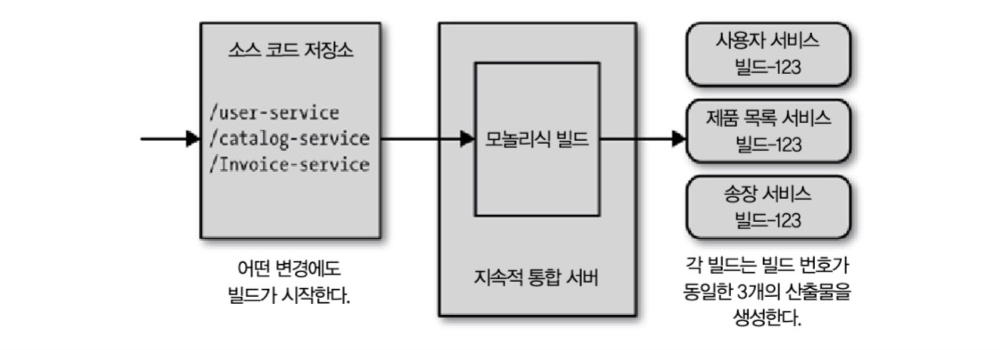
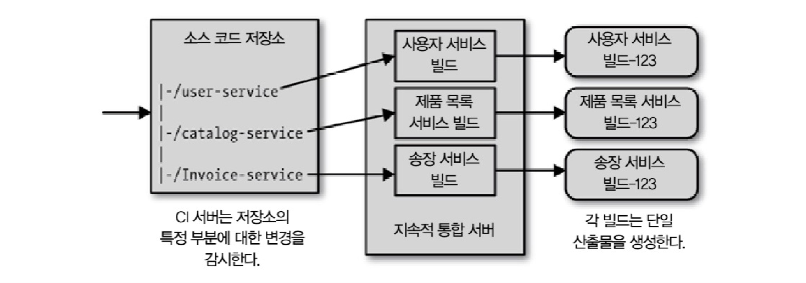
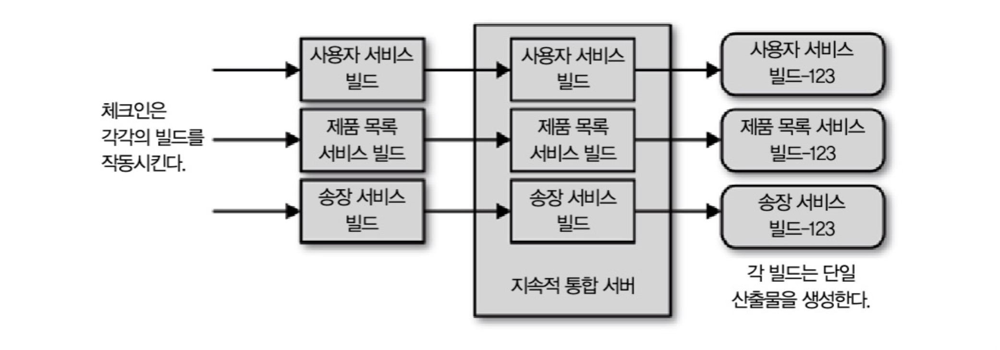
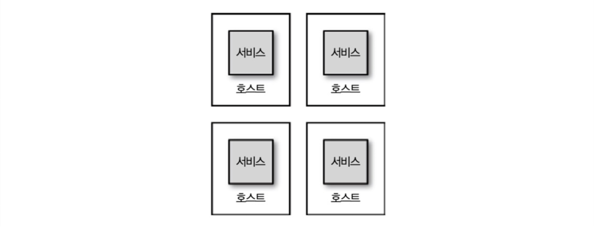
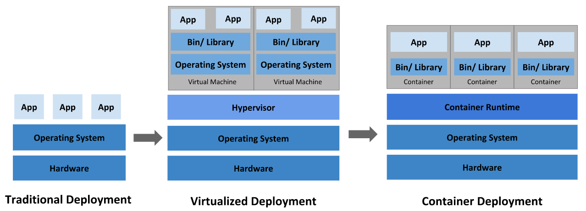
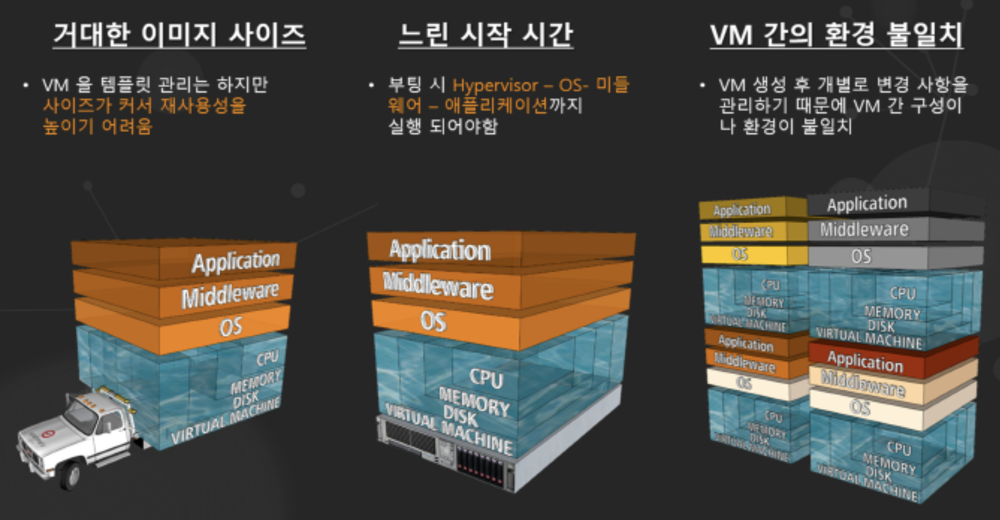
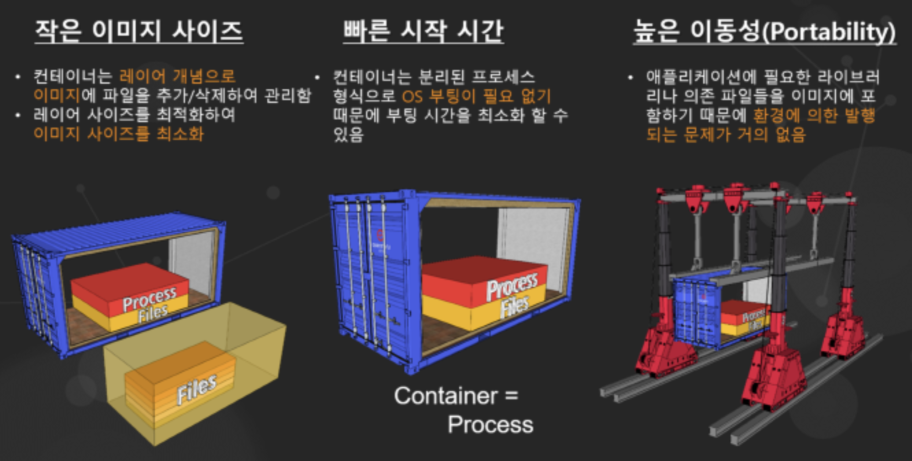

## 6 배포

마이크로서비스 배포하는 방법과 지속적 통합, 지속적 배포에 대해 알아보자.

### 요약

***"CI/CD를 구축하고 빌드 결과물을 컨테이너 이미지로 설정하여 호스트 당 단일 서비스로 배포하자."***

### 6.1 지속적 통합이란

***"CI/CD를 구축하고***

**하는 일**

- 코드 품질에 대해 빠른 피드백을 준다.
- 바이너리 산출물(artifact)를 자동으로 생성한다.

**목표**

- 모든 개발자가 서로 동기를 맞출 수 있게 된다.
- 새롭게 체크인된 코드가 기존 코드와 적절히 통합된다.

#### 6.1.1 정말로 하고 있는가?

***"CI 도구의 사용과 CI의 실천은 다르다."***

정말로 지속적 통합을 하고 있는지 확인하기 위한 3가지 질문이 있다:

1. 하루에 한 번 메인 브랜치에 체크하는가?
   - `feature` 브랜치를 분기하여 작업하고 있더라도 가능한 한 자주 메인 브랜치에 통합해야한다. 
2. 변경을 확인할 테스트 집합이 있는가?
   - 테스트가 없다면 통합해서 제대로 잘 동작하는지 알 수 없다. 
3. 빌드가 깨졌을 때 팀이 그것을 최우선으로 해결하는가?
   - 빌드 문제의 해결과 관련 없는 추가적인 체크인이 발생하면 안된다. 제대로 통합되지 않은 코드를 나중에 통과시키려고 하면 엄청난 노력이 든다.

### 6.2 지속적 통합을 마이크로서비스로 매핑하기

CI 빌드를 어떻게 개별 마이크로서비스와 매핑할지 생각해야한다.  크게 3가지 방법이 있다:

1. 다중 서비스와 단일 CI 빌드
2. 다중 서비스와 다중 CI 빌드
3. 단일 서비스와 단일 CI 빌드

#### 1. 다중 서비스와 단일 CI 빌드  

***모든 마이크로서비스를 위해 단일 저장소와 CI 빌드 사용하기***

가장 단순한 방법으로 통으로 엮는 것이다. 어떠한 체크인도 빌드를 작동시키고 모든 마이크로서비스와 연관된 검증 단계를 수행한 후 다수의 산출물을 생산한다.

**장점**

- 신경쓸 저장소 수가 적으므로 빌드도 개념적으로 단순하다.
- 프로젝트 초기에 한 팀이 모든 작업을 한다면 짧은 기간에 적절한 방법이 될 수 있다.

**단점**

- 한 서비스에서 한 줄의 코드를 바꾸더라도 모든 서비스가 검증되고 빌드된다.
- 빌드가 실운영환경에 전달되는 속도가 느려진다.
- 빌드가 깨진 서비스가 해결되기까지 다른 서비스를 변경할 수 없다.

#### 2. 다중 서비스와 다중 CI 빌드

***독립된 빌드와 매핑된 서브디렉터리를 가진 단일 소스 저장소***

단일 소스 트리를 두고 다수의 CI 빌드가 소스 트리의 부분들과 매핑되도록 한다. 

**장점**

- 신경 쓸 저장소가 하나이므로 체크인/체크아웃 과정이 단순하다.

**단점**

- 여러 서비스 소스 코드에 체크인하는 안 좋은 습관이 들기 쉽다.

#### 3. 단일 서비스와 단일 CI 빌드

***마이크로서비스당 하나의 코드 저장소와 CI 빌드 사용하기***

마이크로서비스 당 하나의 CI 빌드를 둔다. 여기서 각 마이크로서비스는 각자의 CI 빌드에 매핑된 각각의 소스 코드 저장소를 가진다.

**장점**

- 코드 변경이 발생하면 필요한 빌드와 테스트만 수행하고 배포할 하나의 산출물만 얻는다.
- 팀 소유권이 명확해진다.

**단점**

- 저장소를 넘나들며 변경하는 것이 어려워진다.

### 6.3 빌드 파이프라인과 지속적 배포

***빌드 결과물을 컨테이너 이미지로 설정하여"***

**빌드 파이프라인**

지속적 통합을하다보면 여러 단계를 거치게 된다. 테스트는 이 단계 중 하는데, 빠르고 좁은 범위 테스트와 넓고 느린 범위의 테스트를 가질 수 있다. 모든 테스트를 함께 수행하면 광범위의 느린 테스트가 완료되기를 기다리는 동안 빠른 테스트에 대한 피드백을 신속하게 얻지 못할 경우가 있다. 이 문제의 해결책이 바로 빌드 파이프라인이다. **빌드 내에 여러 다른 단계를 두는 것**을 뜻한다. 한 단계는 빠른 테스트를, 다른 단계는 느린 테스트를 설정한다.

**지속적 배포**

모든 체크인의 실환경 준비에 대한 지속적인 피드백을 얻고, 나아가 모든 체크인을 빠짐없이 릴리스 후보로 여기는 접근 방법이다. CD에서는 자동화 단계를 모델링할 때 다단계 빌드 파이프라인의 개념을 확장하여 수행한다.

#### 6.3.1 그리고 피할 수 없는 예외

빌드당 하나의 마이크로서비스 방법이 가장 좋겠지만, 예외로 초창기 도메인에 익숙하지 않을 때는 3장에서 다뤘던 것처럼 하나로 다루는게 나을 수 있다.

### 6.4 플랫폼별 산출물

 ***호스트 당 단일 서비스로 배포하자."***

**산출물의 형태**

대부분 기술 스택은 산출물을 생성하고 설치하는 도구와 함께 훌륭한 산출물의 형태를 가지고 있다.

- 루비의 gem
- 자바의 JAR, WAR
- 파이썬의 egg

**자동화 구성 도구**

하지만 마이크로서비스 관점에서 이러한 산출물만으로는 부족하다. JAR 파일을 루비나 파이썬 앱처럼 실행할 수 있게 만들기 위해 아파치나 엔진엑스의 프로세스 매니저를 설치한다던가 해야한다. **산출물을 배포하고 실행하기 위해** 다른 소프트웨어를 설치해야하는데 이럴 때 퍼펫(Puppet)과 셰프(Chef)같은 **자동화된 구성 관리 도구가 필요**하다. 

> 퍼펫과 셰프 이용해 빌드 산출물 배포 해보기

**산출물의 형태가 다를 때 문제점**

이러한 산출물이 특정 기술 스택에 한정되어 있으면 여러 기술이 혼용될 때 배포가 어려워진다. 많은 서비스를 배포할 때 gem, JAR, Node.js, npm 등 다른 배포 메커니즘을 사용하면 혼동될 것이다. 

### 6.5 운영 체제 산출물

위의 문제를 피하기 위한 한 가지 방법이 **하부 운영 체제에 네이티브한 산출물을 생성**하는 것이다. 레드햇이나 CentOS 기반 시스템에서는 RPM을 우부투에서는 deb 패키지를 윈도우에서는 MSI를 빌드한다.

**단점**

- 처음 패키지 생성 시 어렵다.
- 다양한 운영체제 배포하기가 어렵다. 
  - 다양한 서비스가 운영체제를 맞추는 것으로 어느정도 해결할 수 있다.

### 6.6 커스텀 이미지

**자바 앱 프로비저닝**

퍼펫, 셰프, 앤서블 같은 자동화된 구성 관리 시스템의 한 가지 도전은 머신 상에서 스크립트 실행 소요 시간이다. 자바 앱을 프로비저닝하는 예를 들어보자:

1. 머신 프로비저닝 - 2분
2. JVM 설치 - 3분
3. 소프트웨어 설치

약 5분의 시간이 든다. 이는 매우 사소해보이지만, 시간이 지나면서 점점 더 많은 것이 추가되고, 의존성을 가진 것들을 프로비저닝하는데 점점 더 오랜 시간이 필요해진다. 필수 구성 요소가 설치될 때까지 기다려야하기 때문에 시스템이 제로-다운타임을 허용하지 않는다면 실환경에 배포 시 다운타임이 늘어날 수 있다.

**의존성이 주입된 가상 머신 이미지**

이 기동 시간(spin up time)을 줄이기 위한 한가지 방법은 공통적으로 의존하는 것들을 주입한 가상 머신 이미지를 만드는 것이다. 공용 도구를 자체 이미지에 구워내는 것이다.

**장점**

- 공용 이미지를 한 번만 빌드하므로 시간을 절약해준다.

**단점**

- 이미지 생성 시간이 오래 걸릴 수 있다.
- 생성된 이미지가 매우 클 수 있다.
  - 예를 들어 VMWare 이미지를 생성한다면 약 20GB 이미지를 네트워크를 통해 옮겨야한다.

**이러한 단점은 컨테이너 기술 특히 도커를 통해 회피**할 수 있다.

#### 6.6.1 산출물로서의 이미지

의존성을 구워 넣은 가상 머신 이미지 대신 더 나아가 서비스를 이미지 안에 구워내고 서비스 산출물이 이미지가 되는 모델을 적용할 수 있다. 이미지 상에서 실행되는 서비스가 루비나 자바로 작성되었거나 gem, JAR 파일을 사용하지 신경 쓸 필요가 없다. **신경 써야하는 것은 단지 서비스의 동작 유무다.** 그러므로 이들 이미지를 자동으로 생성하고 배포하는 데 노력을 집중할 수 있고 또 다른 배포 개념인 불변 서버를 구현하는 좋은 방법이 된다.

#### 6.6.2 불변 서버

모든 환경 구성을 소스 관리 시스템에 저장함으로서 서비스 뿐 아니라 환경까지 자동으로 복제하려 노력한다. 하지만 배포 이후 누가 인스턴스에 접속해 소스 관리 시스템에 있는 것과 별개로 변경하면 어떻게 될까? 이는 흔히 환경 구성 불일치라고 알려진 문제로 소스관리 시스템의 코드가 실행 중인 호스트의 환경 구성에 더 이상 반영되지 않는 상태를 초래한다. 

**이를 피하려면 실행 중인 서버에 어떠한 변경도 하지 않아야한다. 아주 작은 변경도 새로운 머신을 생성하기 위해 빌드 파이프라인을 통해야한다.**

### 6.7 환경

우리가 배포하고자 하는 서비스는 모든 다양한 환경에서 동일해야 한다. 그러나 각각의 환경은 각기 다른 목적이 있다.

- 로컬 환경
  - 협업자를 가정하고 스텁으로 작성하여 테스트 수행
- 실환경
  - 다수의 서비스 복제본을 부하 분산 방식으로 배포

두 환경은 많이 다르다. 예를 들어 실환경인 AWS에서 25대의 머신에 소프트웨어 설치를 기다리는 것은 로컬 베이그런트 인스턴스에 서비스를 배포하는 것보다 훨씬 느리다. 이러한 균형은 고정된 것이 아니므로 적절히 균형을 조정하자.

### 6.8 서비스 환경 구성

서비스는 환경 구성을 필요로한다. 환경마다 바뀌어야 하는 구성은 최소화 되어야한다. 환경 구성이 본질적인 서비스 행위를 더 많이 변경할 수록 환경 구성은 환경마다 많이 달라지고 특정 환경에서 발생되는 문제도 많아진다.

이러한 환경 구성은 다음의 두 가지 방법으로 주입할 수있다.

1. 환경당 하나의 산출물을 빌드하고 환경 구성을 산출물에 포함한다.
2. **단일 산출물을 생성하여 환경 구성을 분리해서 관리한다.**

책에서는 2번 방법을 더 추천하고 있으며 자세한 내용은 11장에서 다룬다. (간략하게 얘기하면 1번 방법은 각 산출물의 결과가 다음 산출물에 대한 보장을 해주지 못하므로)

### 6.9 서비스와 호스트 매핑

마이크로서비스를 논의할 때 **머신당 얼마나 많은 서비스가 있어야하는가가** 중요한 질문이다. 이 책에서는 머신이라는 용어보다 더 나은 용어를 제안한다. 서비스를 설치하고 실행하는 운영체제 단위인 호스트를 기반으로 얘기한다.

- 물리 머신에 배포한다면 물리적인 서버는 하나의 호스트로 매핑
- 가상화를 사용한다면 하나의 물리적인 머신은 독립적인 많은 호스트로 매핑

이를 기반으로 호스트당 얼마나 많은 서비스를 넣을 것인지 논의해보자.

#### 6.9.1 호스트당 다수의 서비스

**장점**

- 전적으로 호스트 관리 관점에서 볼 때 단순하다.
  - 인프라스트럭처 팀에서의 작업량은 대체로 호스트 수와 비례한다.
- 가상화는 리소스를 잡아먹으로 가상화에 비해 비용이 덜 든다.
- 개발자에게 더 익숙하다.
  - 마치 랩탑에 여러 서비스를 띄우는 것과 같기 때문이다. (~~더 쉬운거 맞나?~~)

**단점**

- 모니터링이 어렵다.
- 다른 곳에 문제를 일으키지 않도록 배포하기가 어렵다.
- 팀의 자율성을 해친다.
  - 중앙 집권팀에서 배포를 처리해야하며 조율이 필요해진다.
- 산출물의 방식을 제한한다.
  - 다양한 서비스를 단일 산출물로 묶지 않으면 배포가 불가하기 때문이다.

#### 6.9.2 애플리케이션 컨테이너

**장점**

- 인스턴스들의 그룹화나 모니터링 도구등을 다루는 클러스터링 지원처럼 관리성이 향상된 측면에서 많은 혜택을 준다.
- 하나의 런타임에 여러 서비스가 붙을 수 있으므로 런타임(여기서는 JVM)의 부하를 줄이는 면에서 이점이 있다.

**단점**

- 기술 선택을 제약한다.
- 애플리케이션이 런타임 서비스(여기서는  JVM)을 공유할 수 있으므로 사용하는 리소스와 스레드를 분석하는 것 또한 복잡하다.

#### 6.9.3 호스트당 단일 서비스

**장점**

- 쉬운 모니터링과 복원 기능을 제공하며, 단일 장애 지점을 줄인다.
- 추론하기 용이하며 복잡성이 낮다.

**단점**

- 증가되는 호스트 숫자가 잠재적으로 단점이다.

#### 6.9.4 서비스로서의 플랫폼

PaaS(Platform as a Service)를 이용할 때는 단일 호스트보다 더 높은 수준의 추상화 대상에서 작업한다. 좋은 PaaS 솔루션은 개발자를 대신해 아주 많은 것을 해주기 때문에 많은 변경으로 인해 늘어난 오버헤드를 처리하는 훌륭한 방법이 될 수 있다.

### 6.10 자동화

위에서 제시한 많은 문제들의 해답은 결국 자동화로 귀결된다. 또한 개발자가 여전히 생산성을 유지하게 만들어준다. 개발자에게 그들이 담당하는 개별 서비스 또는 서비스 그룹을 셀프 프로비저닝할 수 있는 능력을 주는 것은 그들의 삶을 더 편하게 만든다. 이상적으로 조기에 문제를 발견할 수 있도록 실환경에 서비스를 배포하는 데 똑같은 도구 체인을 사용해야한다. 

자동화에는 다음의 것들이 포함된다:

1. 가상 머신을 시작하거나 종료할 수 있는 한 줄의 코드를 작성할 수 있는가?
2. 개발한 소프트웨어를 자동으로 배포할 수 있는가?
3. 수동적인 개입 없이 데이터베이스의 변경을 배포할 수 있는가?

### 6.11 물리 머신에서 가상화로

많은 수의 호스트를 관리하는 데 사용할 수 있는 핵심적 수단 중 하나는 기존의 물리 머신을 더 작은 부분으로 묶는 방법을 찾는 것이다. 

#### 6.11.1 가상화 비교

***일반적인 타입2 가상화와 경량 컨테이너 비교***

호스트 당 여러 서비스를 쓰기 위해 가상화라는 기술이 생겨났다. 하지만 머신을 나누어서 VM 수를 늘리는 것은 공짜가 아니다. 

가상화에는 3가지 형태가 있다.

**타입 1 가상화**

- VM들이 다른 운영체제가 아닌 하드웨어 상에서 직접 실행된다.
- 하드웨어를 직접 제어하기에 자원을 효율적으로 사용 가능하다
- 별도의 호스트 OS가 없으므로 오버헤드가 적다.
- 여러 하드웨어 드라이버를 세팅해야 하므로 설치가 어렵다.

**타입2 가상화**

- 일반적인 소프트웨어처럼 호스트 OS 위에서 실행된다.
- 호스트 운영체제 위에 **하이퍼바이저**로 불리는 것을 실행한다.
  - CPU와 메모리 같은 자원을 호스트 시스템으로부터 할당해준다.
  - 가상 머신을 조작하도록 통제 계층 역할을 한다.
  - 논리적으로 분리되어 있어 한 VM에 오류가 발생해도 다른 VM으로 퍼지지 않는다.
- VM 마다 종속성 관리가 어렵다.
- 하이퍼바이저가 자원을 많이 소모한다.

**컨테이너 기반 가상화**

- 컨테이너는 하이퍼바이저와 게스트 OS가 필요하지 않으므로 더 가볍다.
- 호스트 시스템의 커널을 다른 컨테이너들과 공유한다.
- 어플리케이션이 실행되기 위한 의존성이 패키지화 되어 있어서 실행시키기 간단하다.
- 가상 하드웨어를 두고 있지 않기 때문에 자원의 격리가 까다롭다.