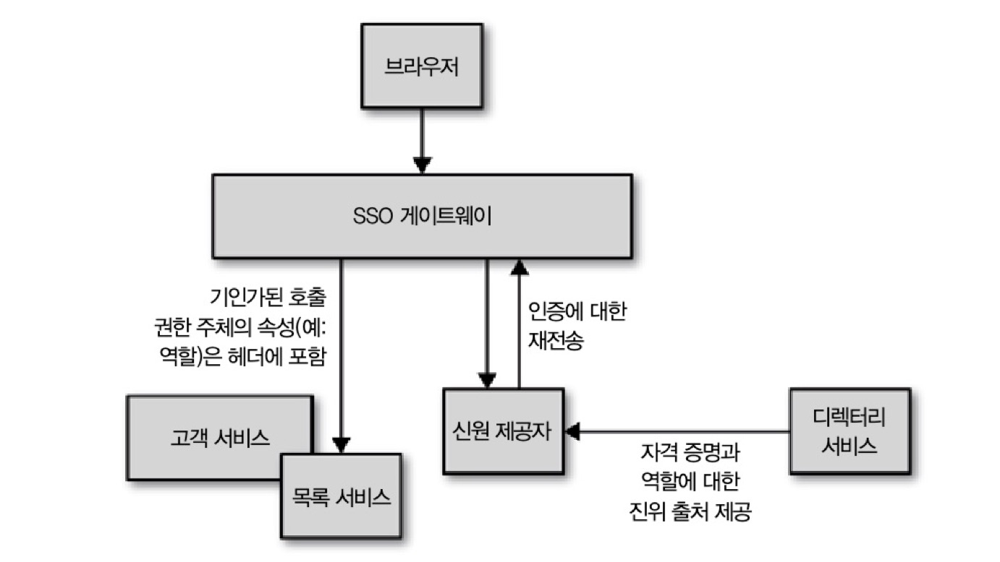
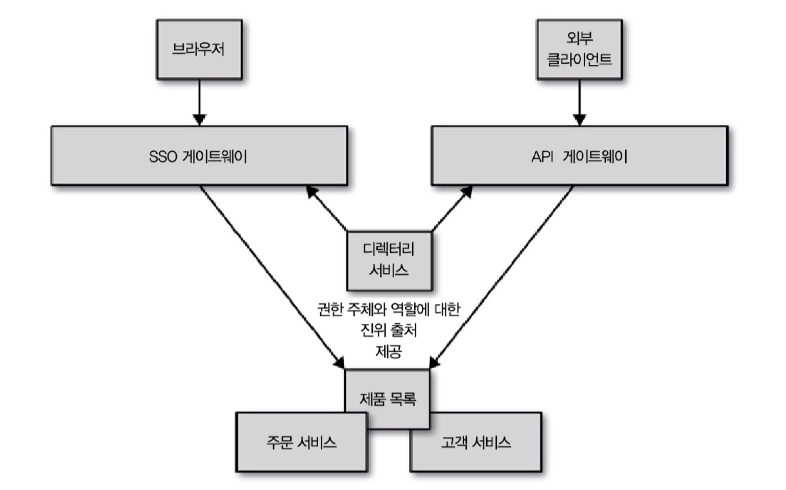
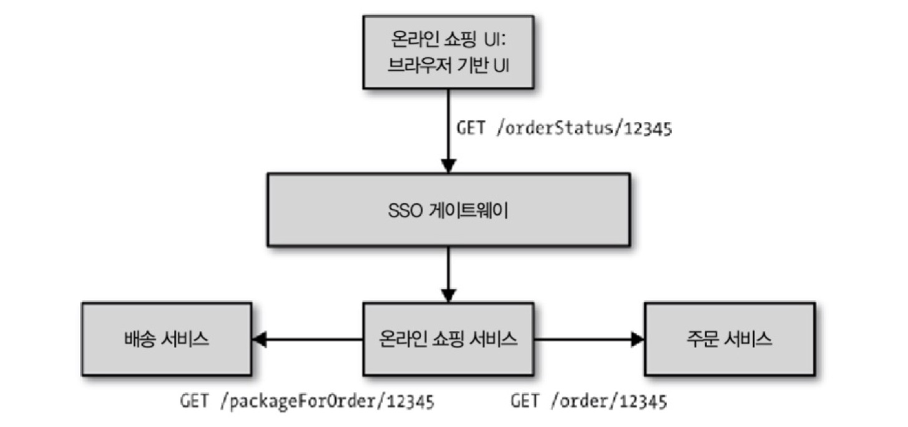
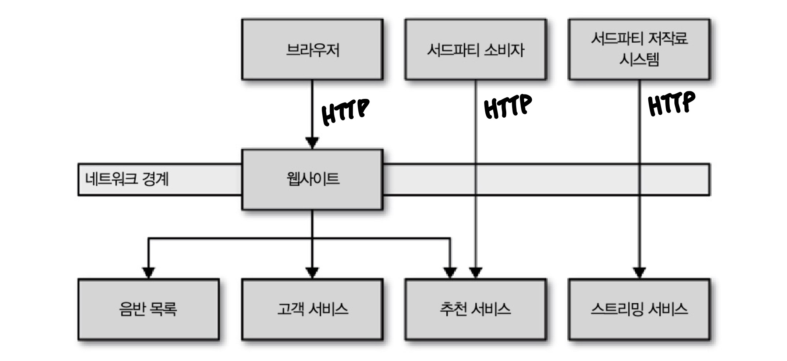
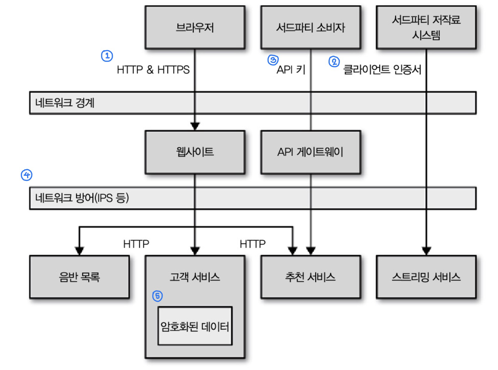

## 09 보안

이 장에서는 다음의 보안적 측면을 알아본다.

- 시스템 설계 보안
- 네트워크 보안
- 하부 운영 체제 보안
- 인적 요소로서의 보안
- 만족할만한 보안의 기준

> **🔍  [에드워드 스노든의 폭로사건](https://namu.wiki/w/NSA%20%EA%B8%B0%EB%B0%80%EC%9E%90%EB%A3%8C%20%ED%8F%AD%EB%A1%9C%EC%82%AC%EA%B1%B4)**
>
> **NSA 기밀자료 폭로사건**(NSA Prism leak)은 [2013년](https://namu.wiki/w/2013년) [6월 10일](https://namu.wiki/w/6월 10일),다전직 [NSA](https://namu.wiki/w/NSA) 계약요원[[3\]](https://namu.wiki/w/NSA 기밀자료 폭로사건#fn-3) 에드워드 조지프 스노든(Edward Joseph Snowden)이 [가디언](https://namu.wiki/w/가디언)과 워싱턴 포스트를 통해, [미국 국가안보국(NSA)](https://namu.wiki/w/NSA)과 영국의 [GCHQ](https://namu.wiki/w/GCHQ) 등의 [정보기관](https://namu.wiki/w/정보기관)들이 전세계의 일반인들의 통화기록과 인터넷 사용정보 등의 개인정보를 [PRISM](https://namu.wiki/w/PRISM)이란 비밀정보수집 프로그램을 통해 무차별적으로 수집, [사찰](https://namu.wiki/w/사찰)해온 사실을 폭로한 [내부고발](https://namu.wiki/w/내부고발) 사건이다.[[4\]](https://namu.wiki/w/NSA 기밀자료 폭로사건#fn-4)

### 9.1 인증과 권한 부여

**인증(authentication)**

자신이라고 말하는 당사자를 확인하는 과정이다.

**권한주체(principal)**

인증되는 사람 또는 사물에 대해 추상적으로 말할 때 그 대상을 말한다.

**권한부여(authorization)**

권한주체를 허용한 행위와 매핑하는 메커니즘이다. 어떤 행동을 해도 되는지 결정하기 위해 그 사람에 대한 정보를 받는다.

**단일 신원(single identity)**

단일 모놀리식 애플리케이션의 경우 일반적으로 애플리케이션 스스로 인증과 권한부여를 처리한다. 예를 들어 파이썬 웹 프레임워크 장고는 사용자 관리 기능이 기본으로 포함되어있다. 하지만 분산 시스템에서는 각기 시스템이 다른 사용자 이름과 비밀번호를 이용해 로그인하는 것을 원치 않는다. 한번의 인증으로 모든 시스템을 이용할 수 있는 것을 단일 신원이라고한다.

#### 9.1.1 일반적인 SSO 구현체

인증과 권한부여에 대한 일반적 접근 방법은 싱글 사인온(SSO) 솔루션이다. 대표적인 구현체로는 SAML과 OpenID Connect가 있다.

> **🔍 SSO(싱글 사인 온)**
>
> 사용자가 **단일 ID 자격 증명 세트로 여러 계정, 소프트웨어, 시스템 및 리소스에 로그인할 수 있도록 하는 액세스 관리 기능**이다. 예를 들어, 직원이 워크스테이션에 로그인하기 위해 자격 증명을 입력하면, 인증 절차를 통해 앱, 리소스 및 클라우드 기반 소프트웨어에도 액세스할 수 있다.
>
> 🔍 **OpenID Connect** 
>
> OAuth 2.0 프로토콜을 기반으로 개발되어 ID 토큰이라고 불리는 JWT(JSON Web Token)를 사용해 범위, 엔드포인트 탐색 등 OAuth 2.0에서 선택 영역을 표준화합니다. 특히 사용자 인증에 초점을 맞추기 때문에 일반 웹사이트 및 모바일 앱에서 사용자 로그인을 활성화하는 데 널리 사용됩니다.
>
> 🔍  **SAML**
>
> OAuth와 관련이 없으며, JWT와 달리 메시지 교환을 통해 XML SAML 형식으로 인증합니다. 이 표준은 기업 사용자가 단일 로그인을 사용해 다수의 애플리케이션에 로그인하는 데 주로 사용됩니다.

권한주체가 웹 기반의 인터페이스를 통해 리소스에 접근하려 할 때 그 사람은 인증을 위해 신원 제공자(Identity Provider)에 재전송된다. 신원 제공자는 그사람에게 사용자 이름과 비밀번호를 요구하거나 이중요소 인증(two-factor authentication)과 같은걸 요구한다. 신원 제공자는 권한 주체의 인증이 충족되면 그 사람의 자원 접근 허용 여부를 결정하도록 서비스 제공자(service provider)에 정보를 전달한다.

> **🔍 신원 제공자(IdP, Identity Provider)**
>
> 사용자를 인증하고 서비스 공급자에게 인증 토큰 (즉, 사용자의 신뢰성을 확인하는 정보)을 제공한다.
>
> 신원 공급자는 다음 인증 중 하나를 수행한다:
>
> - 직접 사용자 인증. 예를 들어, 사용자 이름과 암호를 확인한다.
>
> - 간접 사용자 인증. 예를 들어, 별도의 신원 제공자가 제공한 사용자 ID에 대한 주장의 유효성을 검사한다.
>
> **🔍 서비스 제공자(SP, Service Provider)**
>
> 일반적으로 서비스 제공자는 사용자를 인증하지 않고 대신 신원 제공자에게 인증 결정을 요청한다. 서비스 제공자는 신원 제공자가 관리하는 사용자의 ID와 사용자에 대한 특정 속성을 주장하기 위해 신원 제공자에 의존한다.
>
> - 서비스 공급자는 서비스에 고유한 속성과 함께 사용자의 로컬 계정을 유지할 수도 있다.
> - 서비스 공급자는 사용자의 식별자로 참조할 수 있는 사용자의 로컬 계정을 유지할 수 있다.

#### 9.1.2 싱글 사인온 게이트웨이

***SSO를 처리하는 게이트웨이***

각 마이크로서비스가 신원 제공자를 경유하고 핸드셰이킹을 결정할 수 있겠지만, 중복 작업이 많아진다. 위 그림처럼 서비스와 외부 사이에 프록시처럼 동작하는 게이트웨이를 사용할 수 있다.

**단점**

- 서로 격리된 마이크로서비스가 어떻게 행동할지 추론이 더 어려워진다.
- 보안에 대해 안심하게 될 수 있다. 심층 방어 개념을 적용하자.

#### 9.1.3 세분화된 권한 부여

게이트웨이는 큰 단위 인증 기능을 제공할 수 있지만, 특정 자원 또는 엔드포인트에 대한 접근의 허용 여부는 마이크로서비스 자체에 맡겨야한다. 

**게이트웨이가 맡는 경우**

CALL_CENTER_50_DOLLAR_REFUND 처럼 세분화된 역할이 필요하다. 이것을 유지보수하는 것은 악몽같은 일이다. 서비스 스스로 독립적인 수명주기를 가질 여지를 차단한다.

### 9.2 서비스 대 서비스 인증과 권한 부여

9.1절 까지는 권한주체가 사람이었다. 하지만 프로그램이나 서비스가 서로 인증하려면 어떻게 해야할까?

#### 9.2.1 경계 안의 모든 것 허용하기

이 방법은 특정 경계 내부의 모든 호출을 암묵적으로 신뢰한다고 가정한다. 데이터 민감도에 따라 괜찮은 방법이 될 수 있지만, **중간자 공격(man in the middle attack)**에 노출될 수 있다.

> 🔍 **중간자 공격**
>
> 네트워크 통신을 조작하여 통신 내용을 도청하거나 조작하는 공격 기법

#### 9.2.2 HTTP(S) 기본 인증

HTTP 기본 인증은 클라이언트가 사용자 이름과 패스워드를 표준 HTTP 헤더에 넣어서 전송하는 것이다. 하지만 이 방법은 안전하지 않다. 네트워크상의 어떠한 중간자도 헤더 정보와 데이터를 볼 수 있으므로 HTTPS 상에 수행해야한다. 

**단점**

- 여러 머신에서 SSL 인증서를 관리해야한다.
- SSL 전송은 리버스 프록시(바니쉬, 스퀴드)에 의해 캐시될 수 없다. 서버 내부나 클라이언트 내부에서 캐시해야 한다는 것을 의미한다. 

#### 9.2.3 SAML 또는 OpenID Connect 사용하기

이미 SAML 또는 OpenID Connect를 서비스에 사용한다면 서비스 대 서비스 통신용으로도 사용 가능하다. 

**단점**

- 기본 인증과 마찬가지로 자격증명을 안전하게 저장해야한다. 

#### 9.2.4 클라이언트 인증서

SSL의 계승자인 클라이언트 인증서 형태의 전송 계층 보안(Transport Layer Security, TLS) 기능을 이용한다. 

**장점**

- 서버가 인증서의 진위를 검증하여 유효한 클라이언트인지 확실히 보장할 수 있다.

**단점**

- 서버측 인증서보다 어렵다.

#### 9.2.5 HTTP 기반의 HMAC

HTTP 대신 HTTPS가 전통적인 대안이지만 인증서 관리의 어려움 뿐 아니라 HTTPS 트래픽이 서버에 부담을 줄 수 있게되고 캐시하기도 어렵다는 단점이 있다.

다른 대안은 OAuth 명세서, AWS S3 API에 의해 폭넓게 사용되는 해시 기반 메시징 코드(hash base messaging code, HMAC)을 HTTP 요청 서명에 사용하는 것이다. 원본 메시지가 변하면 그 해시값도 변하는 해싱의 특징을 활용하여 메시지의 변조 여부를 확인한다.

**단점**

- 클라이언트와 서버가 HMAC에 사용되는 비밀키를 안전하게 공유해야한다.
- 아직 양질의 구현체가 부족하다. 
  - AWS S3의 방법 모방을 추천한다.
  - 해싱 함수는 SHA-256 추천한다.
  - JWT도 유사한 방식으로 사용되니까 검토해보자.
- 요청 내용을 조작하지 않았다는 것과, 비밀 키 자체의 기밀성만 보장한다. 요청 데이터는 네트워크상에서 여전히 노출된다.

#### 9.2.6 API 키

트위터, 구글, AWS, Upbit 같은 서비스의 모든 공개 API는 API 키를 사용한다. API 키를 통해 서비스는 호출자를 인식하고 능력에 제한을 둘 수 있다.

> **🔍 API Key**
>
> 특정 사용자만 알 수 있는 일종의 문자열이다. API를 사용하고자 할 때, 개발자는 API 제공사의 포탈 페이등 등에서 API Key를 발급 받고, API를 호출할 때 API Key를 메시지 안에 넣어 호출한다. 서버는 메시지 안에서 API Key를 읽어 이 API가 누가 호출한 API인지를 알 수 있다.

**장점**

- SAML 핸드셰이킹과 비교하면 훨씬 단순하고 직관적이다.

- 일부 API 시스템은 API 키를 기존 디렉터리 서비스에 연결한다. 이를 통해 권한 주체에게 API 키를 발행하고 일반 자격 증명을 관리하는 방식으로 그 키의 생명 주기를 관리할 수 있다. 이 방식으로 서비스에 접근할 가능성을 열어주지만 동일한 진위 출처를 유지할 수 있다.
  

  ***SSO와 API 게이트웨이 간의 권한주체 정보 동기화를 위해 디렉터리 서비스 사용하기***

#### 9.2.7 대리인 문제

***혼동되는 대리인이 나타날 수 있는 예***

온라인 쇼핑 서비스에서는 배송 서비스, 주문 서비스를 접근 할 수 있는 상황이다. 온라인 쇼핑 서비스에 내 계정으로 로그인해 다른 계정의 세부 정보를 볼 수 있다. 이런 것을 악의적인 당사자가 대리인 서비스를 속여 하위 서비스에 인가되지 않은 호출을 하는 **혼동된 대리인 문제**라고 한다.

불행하게도 해결책이 단순하진 않다. 연산의 민감도에 따라 호출자의 신원을 검증하거나 호출자에게 원본 권한주체의 자격증명을 요구하는 암묵적인 신뢰 방법 중에 선택해야한다. 

### 9.3 보관 중인 데이터 보호하기

지금까지 공격자가 하부 시스템에 접근하기 위한 네트워크, 애플리케이션 보안 조치를 알아봤다. 하지만 그들이 성공할 경우를 대비해야한다. 심층 방어가 그 비결이다. 대부분의 보안 침해 사건은 데이터와 연관이 있다. 

#### 9.3.1 잘 알려진 것을 사용하라

데이터 암호화를 직접 구현하지말고 잘 알려진 알고리즘을 사용하라.

#### 9.3.2 키가 전부다

암호화는 암호화될 데이터와 키를 입력받아 암호화된 데이터를 출력하는 알고리즘에 좌우된다. 그럼 키는 어디에 저장할까? 데이터와 키를 같은 데이터베이스에 저장하면 같이 공격당할 수 있다. 다른 곳에 저장하자.

#### 9.3.3 암호화 대상 정하기

모든 데이터를 암호화하는 연산은 결과적으로 더 강력한 하드웨어를 요구한다. 또한 스키마 리팩토링의 하나로서 데이터베이스 마이그레이션이 더 어렵다. 필요한 부분만 암호화하자.

#### 9.3.4 요구형 복호화

데이터를 처음 볼 때 그걸 암호화하라. 데이터 요청이 있을 때 복호화하고 복호화된 데이터는 어디에도 저장되지 않게 하라.

#### 9.3.5 백업 암호화하기

백업 또한 암호화하자.

### 9.4. 심층방어

#### 9.4.1 방화벽

방화벽을 통해 예방을 할 수 있다. 방화벽은 다음의 동작을 할 수 있다:

- 특정 포트에 대해 특정 트래픽을 제한
- 특정 IP 대역에서 유입되는 접속을 차단
- 악의적 공격을 탐지

#### 9.4.2 로깅

좋은 로깅은 예방을 위한 것이 아니라 나쁜 일의 탐지와 회복에 도움이 된다. 그렇지만 로그를 저장할 때 중요한 데이터가 누출되지 않도록 주의하자.

#### 9.4.3 침입 탐지와 방지 시스템

침입 탐지(intrusion detaction system, IDS)와 방지 시스템(intrustion prevention system, IPS)는 외부 지향적 방화벽과 달리 경계 내부의 수상한 행위를 관찰한다. 

#### 9.4.4 네트워크 망 분리

마이크로서비스는 서비스들을 다른 네트워크 세그먼트에 배치할 수 있다. 예를 들어 AWS는 VPC, Private, Public 서브넷, Security 그룹, 네트워크 ACL 등의 보안 조치를 제공한다.

#### 9.4.5 운영 체제

애플리케이션은 시스템에서 실행되는 운영 체제와 기타 지원 도구가 노출하는 보안 취약점을 가질 수 있다. 그러므로 가능한 한 적은 권한을 가진 OS 사용자로 동작하는 서비스로 시작하라. 운영 체제를 위한 보안 모듈(앱아머, SELinuxm grsecurity)도 존재한다.

### 9.5 시범 예제

***안전하지 못한 단순 HTTP를 통해 전송하는 서비스***

지금 까지 배운 내용으로 요 서비스를 더 안전하게 만들어보자.

***조금 더 안전해진 서비스***

1. 브라우저를 위해 비보안 콘텐츠는 캐시될 수 있도록 표준 HTTP 트래픽을 혼합하여 사용할 수 있지만, 로그인된 안전한 페이지의 모든 보안 콘텐츠는 HTTPS를 통해 전송될 것 이다.
2. 서드파티 저작료 시스템에 노출하는 데이터의 특성뿐만 아니라 유입되는 요청의 적법성을 보장하는 것이 염려된다. 서드파티가 클라이언트 인증서를 사용하도록 요구하자.

3. 음반 추천의 피드의 경우 사람들이 쉽게 음반을 구매하도록 그 정보가 가능한 한 많이 공유되길 원한다. 하지만 오남용을 원치 않으므로 누가 데이터를 사용하고 있는지에 대해 알 수 있도록 API 키를 사용하도록하자.
4. 이상적으로 최소한 HTTPS를 사용하고 싶지만 그것을 관리하는건 괴로운 일이다. 대신 적절히 구성된 방화qur과 네트워크 경계를 강화하자.
5. 외부 공격으로부터의 침해를 다 방어했더라도 데이터에 접근할 수 있다. 데이터도 암호화하자.

### 9.6 절약하라

디스크 공간 비용이 낮아지고 데이터베이스 기능이 향상됨에 따라 대용량 정보의 수집과 저장이 쉬워졌다. 하지만 데이터가 많을수록 보안에 신경쓸게 많아진다. 개인을 식별할 수 있는 정보를 가능한 한 많이 제거해서 적용해보자.

**장점**

- 저장하지 않으면 훔쳐갈 것도 없다.
- 저장하지 않으면 아무도(예를 들어 정부 기관) 달라고 요청할 게 없다.

### 9.9 보안 탑재

OWASP's Security Testing Framework 같은 보안 테스팅 도구를 사용하자. 가능하다면 CI/CD에 포함하면 더 안전할 것이다. 