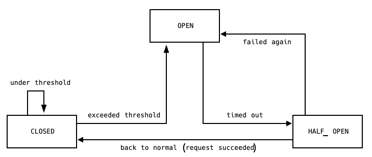

# CHAPTER 11. 대규모 마이크로서비스

분리된 많은 서비스의 장애를 처리하거나 수백 개의 서비스를 관리해야 한다면 어떤 패턴을 갖고 대응해야할까? 이 장에서는 이러한 것들에 대해서 알아보자.

## 11.1 장애는 어디에서나 발생한다

우리는 장애의 원인을 제한하기 위해 최선을 다하지만 특정 규모에서의 장애는 피할 수 없다. 갈수록 안전해지는 하드 디스크에서도 결국 장애는 발생할 수 있다.

대규모 상황에서는 최고가의 하드웨어로 구성된 가장 좋은 구성품 세트를 구입하더라도 부품의 고장을 피할 수는 없다. 따라서 어떤 장애든 결국 발생한다는 것을 가정해야 한다. 이러한 생각을 염두에 두고 장애에 대한 계획을 세운다면 다양한 절충안을 준비할 수 있다.

## 11.2 얼마나 많아야 너무 많은 건가?

7장에서 교차기능 요구 사항에 대해 다뤘다. 교차기능 요구 사항의 이해는 데이터의 내구성, 서비스의 가용성, 처리량, 서비스의 허용 지연시간 같은 측면을 모두 고려하는 것이다.

교차기능 요구 사항은 서비스마다 다르다. 그러나 부하와 장애를 더 잘 처리하기 위해 시스템 확장 방법을 고려해야 한다면 다음 일반적인 교차기능 몇 가지를 정의하고 이해하는 것이 중요하다.

- 응답시간/지연시간
  - 증가하는 부하가 응답시간에 어떻게 영향을 주는지 이해하기 위해 각각 다른 수의 사용자로 측정하는 것은 유용할 수 있다.
  - ex) 웹사이트가 초당 200개의 접속수를 처리할 때 응답시간의 90%가 2초 미만을 유지할 것으로 예상된다.
- 가용성
- 데이터의 내구성

이러한 요구 사항을 지속적이며 체계적으로 측정할 방법이 필요하다.

## 11.3 기능 분해

회복력 있는 시스템 구축에서 가장 중요한 것 중 하나는 안전하게 기능을 분해할 수 있는 능력이다. 만약 마이크로서비스 중 하나가 다운되었을 때 전체 웹 페이지를 이용할 수 없게 된다면 우리는 틀림없이 오직 한 서비스만 사용하는 시스템보다 회복력이 떨어지는 시스템을 맏는 것이다.

우리는 각 서비스의 장애로 인한 충격을 이해하고 적절히 분해하는 방법을 생각해야 한다.

하나로 된 모놀리식 애플리케이션에서 선택할 방안은 그다지 많지 않지만, 마이크로서비스 아키텍처에서는 훨씬 미묘한 상황을 고려해야 한다. 기술적인 결정보다는 비즈니스적인 맥락과 이해를 바탕으로 특정 마이크로서비스가 다운되면 어떤일이 벌어질지 자문하고 무엇을 해야 할지 알아야 한다.

교차기능 요구 사항의 관점에서 개별 기능의 심각도를 생각함으로써 우리가 무엇을 할 수 있는지 훨씬 더 잘 알게 될 수 있다. 장애가 발생할 때 우아하게 처리할 수 있는 기술적인 관점에서 가능한 일들도 고려해보자.

## 11.4 아키텍처 안전 조치

무엇인가 잘못될 때 벌어지는 심각한 파급 효과를 막기 위해 이용하는 몇 가지 패턴을 아키텍처 안전 조치라고 부른다. 이것을 이해하는 것은 필수 사항이며 작은 하나의 문제가 시스템 전체를 망가뜨리지 않도록 시스템 표준화를 강력히 고려해야 한다.

## 11.5 안티프래질 조직

구글이나 넷플릭스의 경우에는 단순한 테스트 수준을 넘어 매년 장애 복구 테스트의 일부로 지진과 같은 대규모 재난까지 시뮬레이션한다. 넷플릭스는 장애를 유발하는 프로그램을 작성해서 하루 단위로 실환경에 실행하는 더 공격적인 방법을 취한다.

모두가 구글과 넷플릭스처럼 극단적으로 할 필요는 없지만 이렇게 분산된 아키텍처에서 발생할 수 있는 장애에 대응하기 위한 준비는 아주 중요하다. 그렇다면 우리 시스템에서 발생하는 장애를 처리하기 위해서는 무엇을 해야 할까?

### 11.5.1 타임아웃

타임아웃은 간과하기 쉽지만 하위 시스템에서 올바르게 사용되는 것이 중요하다.

호출이 실패했다고 판단하는 데 너무 오래 걸리면 전체 시스템이 느려질 수 있다. 너무 빨리 타임아웃하면 동작했을지도 모르는 호출을 실패로 고려할 것이다. 타임아웃이 전혀 없다면 하위 시스템이 다운되어 전체 시스템이 중단될 수 있다.

모든 프로세스 경계 외부의 호출에 타임아웃을 넣고 항상 기본 타임아웃 시간을 설정하라.

### 11.5.2 회로 차단기

하위 자원에 대한 특정 수의 요청이 실패한 후 회로 차단기가 끊어지고 이후의 모든 요청은 회로 차단기가 끊어진 상태이므로 바로 실패한다. 특정 시간 이후 클라이언트는 하위 서비스가 복구되었는지 확인하기 위해 요청 몇 개를 보내고 정상 응답이 오면 회로 차단기를 리셋한다.

회로 차단기가 끊어진 동안 할 수 있는 몇 가지 옵션이 있다. 첫째는 요청을 큐에 넣어두고 나중에 처리하는 것이다. 일부 사용 사례의 경우 비동기 작업의 일부로 작업을 수행한다면 특히 적절할 수 있다. 그러나 동기 호출 체인의 일부분으로 수행되는 경우에는 빨리 실패하는 것이 더 낫다. 이것은 호출 체인의 오류를 전파하거나 기능을 좀 더 정교하게 분해하는 것을 의미할 수 있다.

### 11.5.3 격벽

선박에서의 격벽은 배의 나머지 부분을 보호하기 위해 밀봉 역할을 하는 선체의 벽을 말한다. 배에 물이 새기 시작하면 격벽의 문을 닫아 배의 일부는 잃게 되더라도 나머지 부분은 구할 수 있다.

소프트웨어 아키텍처 측면에서 고려할 수 있는 다양한 격벽이 있다. 여러 다른 서비스를 호출하는 각각의 커넥션마다 서로 다른 커넥션 풀을 사용하는 것이다. 이것은 특정 하위 서비스가 느려지게 되더라도 그 서비스의 커넥션 풀에서만 영향을 받고 다른 호출은 정상 처리되는 것을 보장할 것이다.

### 11.5.4 격리

하나의 서비스가 다른 서비스에 의존할수록 그 서비스의 건강 상태가 다른 서비스의 수행 능력에 더 많은 영향을 미친다. 하위 서버를 오프라인 상태로 만들 수 있는 통합 기술을 사용할 수 있다면 상위 서비스는 계획되지 않은 장애로부터 영향을 받을 가능성이 낮아진다.

## 11.6 멱등성

연산이 연속적으로 몇 번 적용되더라도 첫 적용 후의 결과가 달라지지 않는 성질을 연산의 멱등성 연산이라고 한다. 연산이 멱등적이라는 것은 역효과없이 호출을 반복할 수 있음을 의미한다. 이것은 에러를 복구하는 일반적인 방법으로 처리가 확실하지 않은 메시지를 재생할 때 매우 유용하다.

이 메커니즘은 이벤트 기반의 공동 작업과 궁합이 맞으며 이벤트를 구독하는 동일 유형의 서비스 인스턴스가 여러 개 있는 경우 특히 유용하다.

GET과 PUT 같은 일부 HTTP 동사는 HTTP 명세서에 멱등적이라고 정의되어 있지만 이 경우의 멱등성은 이 호출을 멱등적 방식으로 처리하는 서비스에 의해 좌우된다. 만약 이 HTTP 동사를 비멱등적으로 만들기 시작했으나 호출자는 안전하게 반복적으로 실행할 수 있다고 믿고 있다면 곤경에 처할 수 있다. 하부 프로토콜로 HTTP를 사용한다고 해서 모든 거싱 공짜로 얻어지지는 않는다는 점을 명심해야 한다.

## 11.7 확장

일반적으로 둘 중 한 이유로 시스템을 확장한다.

- 장애에 더 잘 대응하기 위함.
- 성능을 확장하기 위함.

사용 가능한 일반적인 확장 기술을 알아보고 마이크로서비스 아키텍처에 적용할 수 있는 방법을 생각해보자.

### 11.7.1 더 크게 만들기

머신에 더 빠른 CPI와 더 좋은 I/O를 탑재하면 더 짧은 시간에 더 많은 일을 처리하며 지연시간과 처리량을 향상시킬 수 있다. 그러나 수직 확장(vertical scaling)으로 알려진 이 확장 형태는 고 비용이다. 또한 이 확장 형태의 또 다른 문제는 한 대의 서버만 있을 경우 서버의 탄력성(= 회복성)이 크게 향상되지 않는다는 것이다. 그럼에도 불구하고 수직 확장은 빠르고 좋은 해결방안이며 특히 머신의 크기를 쉽게 변경할 수 있는 가상 환경을 사용하고 있다면 더욱 편리한 방법이다.

### 11.7.2 작업부하 나누기

6장에서 이야기 한 것처럼 호스트당 하나의 마이크로서비스는 호스트당 복수 개의 서비스보다 확실히 더 낫다. 초반에는 많은 사람이 비용을 낮추고 호스트를 쉬벡 관리하기 위해 다수의 마이크로서비스를 한 박스에 두고자 했다. 마이크로서비스는 네트워크를 통해 통신하는 독립 프로세스이기 때문에 처리량과 확장성을 향상시키기 위해 서비스를 각각의 호스트로 옮기는 것이 쉽다. 그리고 이 상황에서 단일 호스트의 장애는 호스트 안의 줄어든 마이크로서비스에 영향을 줄 수 있기 때문에 시스템의 탄력성 역시 높일 수 있다.

### 11.7.3 위험 분산

회복성을 위해 확장하는 한 가지 방법은 계란을 한 바구니에 담지 않는 것이다. 한 호스트에 여러 서비스를 배포하지 않는 것이다. 장애가 모든 서비스에 영향을 줄 수 있기 때문이다.

오늘날 대부분의 호스트는 실제로는 가상적인 개념이다. 서비스들이 서로 다른 호스트에 존재하더라도 그 호스트들이 물리적으로 동일한 박스에서 동작하는 가상의 것일 수 있는데, 일부 가상화 플랫폼은 이런 가능성을 줄이도록 물리적으로도 여러 박스에 호스트를 분산하는 기능을 제공한다.

### 11.7.4 부하 분산

동기 방식의 HTTP 엔드포인트를 제공하는 전형적 마이크로서비스의 겨웅 가장 쉬운 방식은 부하 분산기(LB) 뒤에 마이크로서비스 인스턴스가 실행되는 여러 호스트를 배치하는 것이다. 마이크로서비스의 소비자는 자기가 통신하는 마이크로서비스 인스턴스가 하나인지 백 개인지 알지 못한다.

### 11.7.5 작업자 기반 시스템

부하 분산만이 서비스의 다수 인스턴스가 부하를 공유하고 취약함을 줄이기 위한 유일한 방법은 아니다. 운영 특성에 따라 작업자 기반 시스템이 부하 분산 못지 않게 효과적일 수 있다. 한 무리의 인스턴스가 작업 백로그를 공유해서 처리한다고 생각해보자. 이러한 운영 형태는 배치 작업이나 비동기 업무에 적합하다.

유입되는 로드에 맞춰 추가 인스턴스를 바로 실행시킬 수 있다면 이 모델은 부하의 최고조에도 잘 동작한다. 작업 큐 자체가 탄력적인 한 이 모델은 증가된 작업 처리량뿐만 아니라 향상된 탄력성이라는 두 경우 모두를 위해 확장될 수 있다.

## 11.8 데이터베이스 확장

